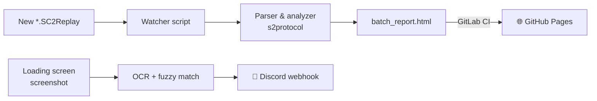

# StarCraft II Replay Analytics

**Live report: [kaseal.github.io/sc2_replays/batch_report.html](https://kaseal.github.io/sc2_replays/batch_report.html)**

This repository hosts an automatically generated dashboard of StarCraft II 2v2 matches. Every time a game ends, a fully automated pipeline picks up the replay file, analyzes it, rebuilds the HTML report, and publishes it here via GitHub Pages — no manual steps involved.

## What the app does, in simple words

1. **Watch** — a small background script notices when StarCraft II saves a new replay file after a match.
2. **Parse** — the replay is decoded with Blizzard's official [s2protocol](https://github.com/Blizzard/s2protocol) library to extract players, races, MMR, match length, map, and in-game events.
3. **Analyze** — game events are scanned to detect early aggressive strategies ("cheeses"), track win rates per opponent, and build map and seasonal statistics.
4. **Publish** — the results are rendered into a single interactive HTML page (`batch_report.html`), committed automatically, and deployed through GitLab CI to GitHub Pages.

There is also a companion real-time tool: during the game loading screen it reads opponent names from a screenshot using OCR (EasyOCR), fuzzy-matches them against the stored match history (RapidFuzz), and instantly posts their stats and cheese history to a Discord channel.

## Architecture diagram

The full processing flow is documented in **[SC2_Replay_Processing.pdf](https://kaseal.github.io/sc2_replays/SC2_Replay_Processing.pdf)** — it shows how the four components (replay watcher, report generator, screenshot recognition, and Discord notifier) connect and which files they hand off to each other.

Simplified overview:

## Tech stack

- **Python** — replay parsing, analysis, and HTML report generation
- **[s2protocol](https://github.com/Blizzard/s2protocol) + mpyq** — decoding StarCraft II replay files
- **EasyOCR + RapidFuzz** — real-time opponent recognition from loading-screen screenshots
- **PowerShell** — file watching and sync automation
- **GitLab CI → GitHub Pages** — automated publishing of the generated report
- **Discord webhooks** — instant match intel notifications

## What's in this repo

| File | Description |
|---|---|
| [`batch_report.html`](https://kaseal.github.io/sc2_replays/batch_report.html) | The generated dashboard — match history, win rates, map stats, cheese detection |
| [`SC2_Replay_Processing.pdf`](https://kaseal.github.io/sc2_replays/SC2_Replay_Processing.pdf) | Architecture diagram of the whole pipeline |

The source code of the pipeline lives in a separate project; this repository is its publishing target, updated automatically after every match.
